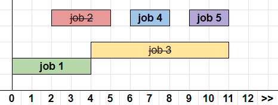

[<< Về trang chính](../../index.md)

# Tham lam (Greedy)

## Mục lục
* [Mở đầu](#mở-đầu)
* [Ví dụ](#Ví-dụ)
    * [1. Gàu nước](#1-gàu-nước)
    * [2. Tổng lớn nhất của một chuỗi số](#2-tổng-lớn-nhất-của-một-chuỗi-số)
    * [3. Đổi tiền](#3-đổi-tiền)
    * [4. Sắp xếp công việc](#4-sắp-xếp-công-việc)
* [Ứng dụng](#ứng-dụng)

## Mở đầu

Một thuật toán được gọi là Tham lam nếu như nó chọn lựa chọn lục bộ tối ưu nhất có thể của hiện tại và hy vọng sẽ đạt được lựa chọn tối ưu toàn cảnh.

Giả sử như bạn đang rãnh rỗi và muốn làm `K` công việc bán thời gian, lúc này đang có `N` công việc đang tuyển với các mức lương khác nhau. Không kể về các điều kiện khác, nếu như bạn muốn kiếm được nhiều tiền nhanh nhất thì bạn phải lựa chọn các công việc theo thứ tự lương cao xuống lương thấp. Theo ngôn ngữ của toán học là có một chuỗi số gồm `N` phần tử, hãy chọn `K` phần tử sao cho có tổng là lớn nhất.

Đây là một trong những trường hợp mà Thuật toán Tham lam cho kết quả chính xác và Thuật toán chạy rất nhanh. Tuy nhiên, trong rất nhiều trường hợp khác, Thuật toán Tham lam cho kết quả sai.

Để một bài toán có thể giải bằng thuật toán Tham lam, nó phải có hai tính chất:
1. Cấu trúc con tối ưu
2. Tính chất lựa chọn tham lam (khó chứng minh)

Bài viết chỉ có mục đích cho bạn làm quen với tư duy Tham lam và giới thiệu các dạng bài toán Tham lam kinh điển, bi sâu vào hai tính chất trên sẽ khiến bài viết khó tiếp cận.

## Ví dụ

Thật chất, Tham lam không phải là Thuật toán, nói đúng hơn nó là một cách giải quyết một vấn đề. Tham lam không có hình dáng, công thức hay một quy trình cụ thể và vì thế mà những bài toán giải bằng Tham lam sẽ không có một dạng cụ thể. Nên mình nghĩ cách tốt nhất là đi qua một vài ví dụ để bạn có một cái nhìn toàn vẹn hơn.

#### 1. Gàu nước

> Phong muốn múc `L` lít nước ra những cái gàu nước, biết rằng Phong có hai loại gàu gồm loại 5 lít và loại 2 lít, mỗi loại có vô số số lượng. Hãy đếm số lượng gàu ít nhất mà anh ta cần để múc hết `L` lít nước đó ra.

> Ví dụ: `L` = 26 thì có thể dùng 5 gàu `5 lit` và 1 gàu `2 lit`, tổng số là 6 gàu.

Với bài toán trên, vì chúng ta đang tối thiểu hóa số lượng gàu (càng ít càng tốt) để múc một lượng `L`, nên một gàu mà chứa được càng nhiều nước thì không phải nó càng tốt hơn chăng? Vì thế, chẳng có lý do gì để ta sử dụng gàu 2 lít cả, vì gàu 5 lít cũng chứa được 2 lít mà. Đáp án của bài trên là chỉ cần chia `L` cho 5 và cộng thêm 1 nếu có dư.

Bài toán trên cũng có thể khái quát hóa thành Phong có `N` loại gàu với mỗi loại là vô số số lượng, và cũng tương tự ta chỉ lựa chọn loại gàu có thể chứa được nhiều nhất. Luôn chọn loại gàu chứa được nhiều nhất là Tiêu chí Tham lam của chúng ta, và với tiêu chí này, chúng ta có thể giải quyết được bài toán trên.

#### 2. Tổng lớn nhất của một chuỗi số

Bây giờ chúng ta xem xét một bài toán hơi khác so với bài toán trên:

> Phong muốn múc `L` lít nước ra những cái gàu nước, biết rằng Phong có một số lượng gàu và mỗi gàu có thể chứa được một lượng nước riêng biệt. Nếu như với `N` gàu đó anh có thể múc được hết thì Số lượng gàu tối thiểu mà anh ta phải dùng là bao nhiêu?

> Ví dụ: `L = 6` và `gàu = {3, 1, 3, 4, 1}`. Có thể chọn `{4, 1, 1}` để có thể múc được là `6` nhưng như vậy là 3 gàu. Chọn `{3, 3}` sẽ tối ưu hơn.

Cũng với Tiêu chí Tham lam _chọn gàu với Lượng nước chứa được lớn nhất_, nếu vẫn còn dư nước thì chúng ta sẽ liên tục chọn gàu to nhất có thể và múc. Hành động **luôn chọn gàu to nhất có thể** ở đây chính là định nghĩa của Giải thuật Tham lam, và việc này sẽ cho kết quả tối ưu bởi vì như trên đã nói, nếu ta chỉ quan tâm số lượng thì ta nên lấy cái mà làm được nhiều hơn cái còn lại.

Bài toán trên cũng có thể khái quát hóa hơn nữa:

> Cho dãy số `A` gồm `N` phần tử. Chọn ra `K` phần tử sao cho tổng của chúng là lớn nhất.

Tại đây, ta biết chắc rằng chọn `K` phần tử lớn nhất trong dãy số sẽ luôn đúng, và cách làm này có độ phức tạp là `O(K)` (không tính tới việc sắp xếp chuỗi số), thay vì chúng ta phải xét mọi trường hợp có thể là `tổ hợp K của N` là độ phức tạp giai thừa `O(N!)`.

#### 3. Đổi tiền

Bài toán như sau:

> Chúng ta có một lượng tiền là `V` và muốn đổi tất cả ra thành tiền xu. Có 4 loại tiền xu bao gồm: `{25, 10, 5, 1}`. Nếu chúng ta muốn đổi ra ít tiền xu nhất và tổng chúng bằng `V` thì số xu đó là bao nhiêu?

Lấy ví dụ: `V = 42`. Ở đây, chúng ta sẽ **Tham lam theo Tiêu chí** đổi sang loại đồng xu có giá trị cao nhất trước:

42 - **25** = 17 => 17 - **10** = 7 => 7 - **5** = 2 => 2 - **1** = 1 => 1 - **1** = 0

Cần ít nhất **5 đồng xu** và đây là đáp án tối ưu.

Tại sao luôn lựa chọn loại tiền xu có giá trị cao nhất sẽ tối ưu? Một cách để hiểu là vì chúng ta chỉ quan tâm đến số lượng càng ít nhất có thể, với số tiền là `25` bạn có thể sử dụng `{10, 10, 5}` là 3 đồng nhưng chỉ cần 1 đồng `25` là đã đủ. Ít hơn, nhưng có tác dụng bằng nhiều hơn thì đương nhiên chúng ta sẽ chọn. Đây là sự tương đồng của bài toán này và bài Gàu nước. 

Tuy nhiên, Giải thuật Tham lam này **không đúng** với mọi loại tiền xu. Giả sử có một hệ thống tiền tệ sử dụng các loại tiền xu `{4, 3, 1}` thì để tạo `V = 6`, theo giải thuật tham lam chúng ta sẽ chọn `{4, 1, 1}` trong khi đáp án tối ưu là sử dụng 2 đồng `{3}`. Để giải quyết dạng khái quát hơn của bài Đổi tiền chúng ta cần đến **Giải thuật Quy Hoạch Động** và nó nằm ngoài các topics của chúng ta, các bạn có thể đọc thêm.

#### 4. Sắp xếp công việc

Tóm tắt bài toán như sau:

> Tồn tại `N` công việc mà mỗi công việc bao gồm một thời điểm bắt đầu và một thời điểm kết thúc. Bạn muốn chọn ra một tập hợp các công việc sao cho không có hai công việc nào xảy ra trùng nhau. Số lượng công việc lớn nhất mà bạn có thể chọn là bao nhiêu?

Bài toán này cực kỳ nổi tiếng và đã có rất nhiều tài liệu đã nói về nó. [VNOI đã dịch một bài viết](https://vnoi.info/wiki/translate/topcoder/Greedy-is-Good) rất xuất sắc và có nói rất kỹ về bài toán này. Dài nhưng rất hay, nó có đề cập đến các tiêu chí tham lam khác và vì sao nó không hiệu quả.

Quay lại hiện tại, Tiêu chí tham lam chính xác đó là luôn chọn công việc mà có thời điểm kết thúc sớm nhất. Sau khi công việc bạn đã chọn kết thúc thì lại chọn một công việc khác diễn ra sau đó cùng với tiêu chí ban nãy. Chọn cho đến khi hết công việc để chọn, bạn đã có cho mình một lịch trình bận rộn và rất nhiều công việc.

Ví dụ:

Với dòng thời gian và thứ tự của các công việc diễn ra như trên, các cách chọn tối ưu gồm `{job1, job4, job5}` và `{job2, job4, job5}`, cả hai đều có `3` công việc và đây là số công việc nhiều nhất bạn có thể đạt được.

Giải thuật Tham lam của chúng ta sẽ đầu tiên xem xét công việc kết thúc sớm nhất, theo trên thì đó là `job1` và chúng ta chọn nó. Sau đó, chúng ta lại xem xét công việc kết thúc sớm tiếp theo. `job2` kết thúc sớm nhưng vì nó đè lên `job1` rồi chúng ta không thể chọn nó được. `job4` là lựa chọn duy nhất kế tiếp, và rồi đến `job5`.

## Ứng dụng
Ngoài những bài toán trên còn rất nhiều bài toán khác, mục đích của bài viết chỉ ở tầm giới thiệu thôi. Các bạn có thể khám phá thêm một vài bài nữa qua link bài dưới đây:

[Link contest practice Thuật toán Tham lam](https://codeforces.com/contests/289715)

- [Link lời giải](../Solution/greedy/index.md)

## Đọc thêm

- [Tham lam là tốt @VNOI](https://vnoi.info/wiki/translate/topcoder/Greedy-is-Good)
- [Các dạng bài sử dụng thuật toán tham lam @TopDev](https://viblo.asia/p/thuat-toan-tham-lam-greedy-algorithm-XQZGxozlvwA)
- [Thuật toán Tham lam @Viblo](https://viblo.asia/p/thuat-toan-tham-lam-greedy-algorithm-XQZGxozlvwA)