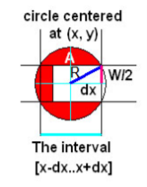

# Greedy - J - Watering grass

[Về Index](index.md)

## Hint giải 
Bài này chỉ là bài trước nó: [Minimal Coverage](I_minimal-coverage.md) kèm với một chút hình học. Bạn phải bằng cách nào đó chuyển bài toán này thành bài toán bao phủ đoạn thẳng, cụ thể là làm xuất hiện tọa độ các đoạn thẳng rồi sau đó giải tương tự.

## Lời giải
<details>
    <summary> Spoiler </summary>
    <p align='center'>
    
    </p>

Ta sẽ tính `dx` sử dụng công thức Pythagoras với cạnh huyền là `R` và một cạnh đáy là `w/2`. Sau đó, chuyển đường tròn thành một đoạn thẳng `[x-dx, x+dx]`. Từ đó, ta có bài toán y chang như `Minimal Coverage`.
</details>

## Code giải
```cpp
#include <bits/stdc++.h>
using namespace std;

int n, l, w;
vector<pair<double, double>> seg;

void input() {
    cin >> n >> l >> w;

    for (int i = 0; i < n; i++) {
        double x, r; 
        cin >> x >> r;
        double dx = sqrt( max(r*r - w*w/4.0, 0.0) );
        seg.push_back({x - dx, x + dx});
    }
}

bool solve() {
    sort(seg.begin(), seg.end());

    double Left = 0.0, Right = 0.0;
    int segUsed = 0;
    for (int i = 0; i < n && Left < l; i++) {
        if (Left < seg[i].first) {
            Left = Right;
            segUsed++;
        }
        if (seg[i].first <= Left) {
            Right = max(Right, seg[i].second);
        }
    }

    if (Left < l && Left < Right) {
        Left = Right; segUsed++;
    }

    if (Left < l) {
        printf("-1\n");
    } else {
        printf("%d\n", segUsed);
    }
    return true;
}

int main() {
    input();
    solve();
}
```