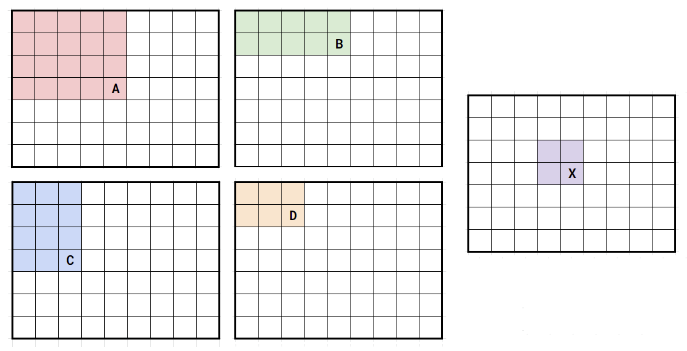

# Arrays 2D - E - Truy vấn Tổng 2D

[Về Index](index.md)

## Hint giải
Đây là dạng bài cơ bản cho Prefix Sum ở 2D. Ta sẽ dùng ý tưởng giống như mảng 1D cho mảng 2D.

Gọi `prefixSum[x, y]` là tổng của một khu vực hình chữ nhật có ô trái trên là `[1, 1]` và ô phải dưới là `[x, y]`. Sau đó, ta có thể tính được tổng của mọi khu vực hình chữ nhật trên mảng 2 chiều của ta.

<p align='center'>
    
</p>

Hình trên mô tả mối quan hệ của một khu vực hình chữ nhật bất kỳ. Liệu bạn có thể nghĩ ra công thức tính tổng của một khu vực hình chữ nhật có ô trái trên là `[x1, y1]` và ô phải dưới là `[x2, y2]` không? Công thức này sẽ cho kết quả trong `O(1)`.


## Lời giải
Giả sử `X` là khu vực có ô trái trên là `[x1, y1]` và ô phải dưới là `[x2, y2]`.
Với hình trên, ta có `X = A - B - C + D`.

## Code nguồn

```cpp
#include <iostream>
using namespace std;

int n, m;
long long a[1002][1002];
int q;

int main() {
    ios::sync_with_stdio(0);
    
    cin >> n >> m;
    for (int i = 1; i <= n; i++)
        for (int j = 1; j <= m; j++)
            cin >> a[i][j];
    
    for (int i = 1; i <= n; i++)
        for (int j = 1; j <= m; j++)
            a[i][j] += a[i-1][j] + a[i][j-1] - a[i-1][j-1];
    
    cin >> q;
    for (int x1, y1, x2, y2; q; q--) {
        cin >> x1 >> y1 >> x2 >> y2;
        cout << a[x2][y2] - a[x2][y1-1] - a[x1-1][y2] + a[x1-1][y1-1] << '\n';
    }
    
}
```