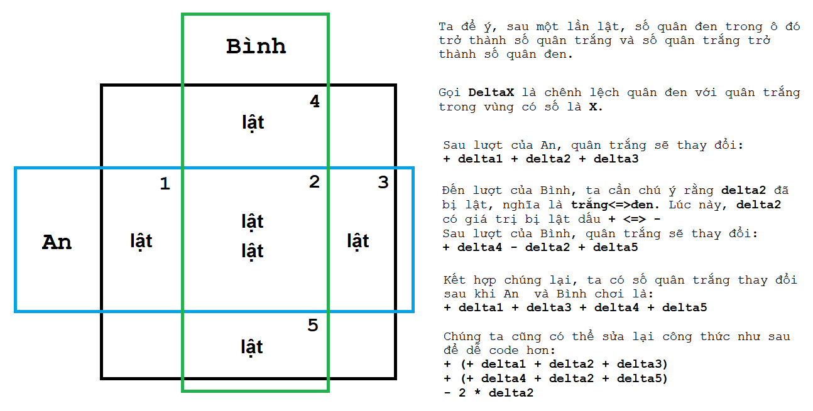

# Arrays 2D - G - Cờ đập

[Về Index](index.md)

## Hint giải
Đây là một bài ứng dụng Prefix Sum 2D. Bài toán cho phép độ phức tạp là `O(N*N)`, nghĩa là hai vòng for lồng nhau.

<details>
    <summary> Spoiler </summary>
<p align = 'center'>

</p>
</details>

## Lời giải
<details>
    <summary> Spoiler </summary>
<p align = 'center'>

</p>
</details>

## Code nguồn

```cpp
#include <iostream>
using namespace std;

int N, K;
int board[1001][1001];
const int BLACK = 0;
const int WHITE = 1;

void input() {
    cin >> N >> K;
    for (int i = 1; i <= N; i++)
        for (int j = 1; j <= N; j++) {
            char c; cin >> c;
            board[i][j] = (c == 'B' ? BLACK : WHITE);
        }
}

int whites[1001][1001];

int getChangeAfterFlip(int x1, int y1, int x2, int y2) {
    int white = whites[x2][y2] - whites[x1-1][y2] - whites[x2][y1-1] + whites[x1-1][y1-1];
    int black = (x2-x1+1)*(y2-y1+1) - white;
    return black-white;    
}

int maxWhite = 0;
void process() {
    for (int i = 1; i <= N; i++)
        for (int j = 1; j <= N; j++)
            whites[i][j] = (whites[i-1][j] + whites[i][j-1] - whites[i-1][j-1]) + board[i][j];
    
    for (int x = 1; x + K - 1 <= N; x++) {
        int whiteAfterAn = whites[N][N] + getChangeAfterFlip(x, 1, x+K-1, N);
        //printf("x = %d -> %d\n", x, whiteAfterAn);
        int whiteAfterBinhGreedy = N*N;
        for (int y = 1; y + K - 1 <= N; y++) {
            int whiteAfterBinh =
                whiteAfterAn + getChangeAfterFlip(1, y, N, y+K-1)
                             - 2*getChangeAfterFlip(x, y, x+K-1, y+K-1);
            //printf("\ty = %d -> %d\n", y, whiteAfterBinh);
            whiteAfterBinhGreedy = min(whiteAfterBinhGreedy, whiteAfterBinh);
        }
        maxWhite = max(maxWhite, whiteAfterBinhGreedy);
    }
}

void output() {
    cout << maxWhite << '\n';
}

int main() {
    input();
    process();
    output();
}
```